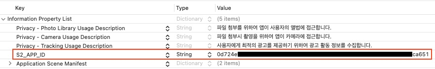

# ios_sdk
iOS SDK Guide

어드민에 매체를 등록한 후 APP_ID 를 발급 받는다.
APP_ID 를 info.plist 파일에 등록한다.



## 라이브러리 등록하기
다운로드 받은 SDK 압축파일을 풀면 s2offerwall.xcframework 폴더가 생성됩니다. s2offerwall.xcframework 폴더를 XCode 내에 마우스로 드래그합니다. 
이후 XCode -> Target -> General -> Frameworks, Libraries, and Embedded Content 항목에 s2offerwall.xcframework 가 있는 것을 확인하시고 Embed 설정을 Embed & Sign 으로 변경합니다.

# 초기화
## S2Offerwall
- public static func initSdk(_ listener:InitializeListener?)
- InitializeListener
```swift
public protocol InitializeListener : NSObjectProtocol {
    optional func onSuccess()
    optional func onFailure()
}
```
- 호출 예시
```swift
class ViewController: UIViewController, S2Offerwall.InitializeListener {
    
    override func viewDidAppear(_ animated: Bool) {
        super.viewDidAppear(animated)
        
        S2Offerwall.initSdk(self)
    }

    func onSuccess() {
        NSLog("on Success")
    }
    
    func onFailure() {
        NSLog("on Failure")
    }
}
```

또는

- public static func initSdk(onCompletion:@escaping (Bool) -> ())
- 호출 예시
```swift
class ViewController: UIViewController {
    
    override func viewDidAppear(_ animated: Bool) {
        super.viewDidAppear(animated)
        
        S2Offerwall.initSdk() { result in
            if (result) {
                NSLog("init succcess")
            }
            else {
                NSLog("init failure")
            }
        }
    }
}
```

## 앱 추적 동의 및 권한 설정
앱 광고의 경우 유저들의 광고 참여여부를 확인하기 위해서는 사전에 앱추적동의를 받아야합니다. 앱추적동의는 iOS 14부터 제공되는 기능으로 기기의 IDFA 값 수집을 위하여 필요합니다. 
앱 추척 동의 창을 띄우기 위해서는 우선 info.plist 파일에 Tracking Usage Description 항목을 작성해야합니다. (위 이미지 참고) 이후 앱 추적 동의 창을 띄우기 위한 iOS API 를 호출합니다.
또는 SDK가 제공하는 편의 함수를 호출하실 수 있습니다. 앱 추적 동의 창은 앱이 시작되는 시점에 띄우는 것을 권장합니다.

- public static func presentATTPopup(_ viewController:UIViewController)

추가적으로 카메라와 앨범 접근을 위한 권한 설정을 진행합니다. 이것은 스크린 샷을 등록하는 형태의 광고 참여 또는 이용문의시 캡쳐화면 첨부를 위하여 필요합니다. (위 이미지 참고) 

# 사용자 정보 설정
광고 참여를 위해서는 사용자 정보가 필요합니다. 일반적으로 매체의 로그인 ID 를 사용합니다.

- S2Offerwall.setUserName(userName:String)

설정한 사용자 정보를 삭제하기 위해서는 아래 API 를 호출합니다.
- S2Offerwall.resetUserName()

# 오퍼월 이벤트
오퍼월에서 광고 참여를 위해서는 사용자 정보가 필요한데 광고 참여 시점에 사용자 정보가 아직 설정이 안되었다면 onLoginRequest() 이벤트가 호출됩니다.
또한 오퍼월이 닫혀야 할 시점에는 onCloseRequest() 가 호출됩니다. 이 이벤트 함수들은 EventListener 에 정의되어 있으며 개발사는 EventListener 를 구현하여 사용합니다.

- EventListener
```swift
public protocol EventListener : NSObjectProtocol {

    // 오퍼월에서 광고 참여 시점에는 사용자 정보가 필요하다. 이때 매체의 경우 로그인 아이디를 설정해야한다.
    optional func onLoginRequested(param:String?)

    // 오퍼월이 닫혀야 할 경우 아래 이벤트가 호출된다. 매체에서는 적절한 액션을 수행하도록 구현한다.
    optional func onCloseRequested(param:String?)
}
```
- 사용예시
```swift
class ViewController: UIViewController, S2Offerwall.EventListener {
    
    override func viewDidAppear(_ animated: Bool) {
        super.viewDidAppear(animated)

        S2Offerwall.initSdk() { result in
            if (result) {
                NSLog("init succcess")
            }
            else {
                NSLog("init failure")
            }
        }
        
        S2Offerwall.setEventListener(self)
    }
    
    // S2Offerwall.EventListener
    func onLoginRequested(param:String?) {
        NSLog("#### S2Offerwall.onLoginRequested \(param)")
        S2Offerwall.setUserName(userName: "<login user id>")
    }
}
```

  
# S2OfferwallViewController
오퍼월을 별도의 UIViewController 로 띄워준다. 어드민에서 설정한 플레이트먼트 명칭을 파라메터로 전달해야한다.
- S2Offerwall.presentOfferwallInternal(_ viewController: UIViewController, placementName: String)
- Modal 창으로 띄워준다.
- 호출예시
```swift
class ViewController: UIViewController, S2Offerwall.EventListener {
    @IBAction func buttonTapped() {
        S2Offerwall.presentOfferwall(self, placementName:S2Offerwall.MAIN)
    }
```

- S2Offerwall.pushOfferwallInternal(_ navigationController: UINavigationController, placementName: String)
- NavigationController 를 사용하여 Push 방식으로 띄워준다.


# S2OfferwallView
오퍼월을 View 로 제공한다. S2OfferwallView 를 생성하여 화면에 추가한 후에 EventListener를 설정하고 이후 표시할 플레이스명을 호출한다.
- public func load(placementName:String? = nil, isPopup:Bool = false)

- 사용예시

```swift
 private func setup() {
    
    let offerwallView = S2OfferwallView()
    view.addSubview(offerwallView)
    
    offerwallView.translatesAutoresizingMaskIntoConstraints = false
    
    offerwallView.leftAnchor.constraint(equalTo: view.leftAnchor).isActive = true
    offerwallView.rightAnchor.constraint(equalTo: view.rightAnchor).isActive = true
    offerwallView.topAnchor.constraint(equalTo: view.topAnchor).isActive = true
    offerwallView.bottomAnchor.constraint(equalTo: view.bottomAnchor).isActive = true
    
    offerwallView.setEventListener(self)
    
    S2Offerwall.initSdk() { succ in
        if (succ) {
            offerwallView.load()
        }
    }
}
```


